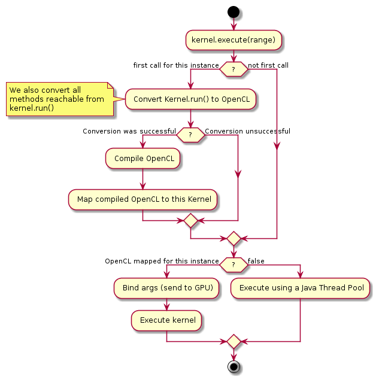

#HowToAddUML
*How to add plantuml docs to wiki pages Updated Apr 20, 2013 by frost.g...@gmail.com*

Go to http://www.plantuml.com/plantuml and type in the text for you diagram.

Hit submit and check out the diagram.

Once you are happy, so with something like

    start
    :kernel.execute(range);
    if (?) then (first call for this instance)
        : Convert Kernel.run() to OpenCL;
        note
           We also convert all
           methods reachable from
           kernel.run()
        end note
        if (?) then (Conversion was successful)
           : Compile OpenCL;
           : Map compiled OpenCL to this Kernel;
        else (Conversion unsuccessful)
        endif
    else (not first call)
    endif
    if (?) then (OpenCL mapped for this instance)
       : Bind args (send to GPU);
       : Execute kernel;
    else (false)
       : Execute using a Java Thread Pool;
    endif
    stop
Paste the resulting URL into the wiki page but append %20as.png at the end of the URL

http://www.plantuml.com:80/plantuml/img/BLAHBLAH%20as.png

To get this!

